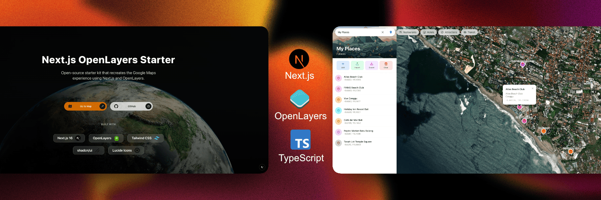

# Next.js OpenLayers Starter

A production-ready Next.js 16 starter template with vanilla OpenLayers integration. Build modern, interactive map applications with a Google Maps-inspired UI.

[](https://nextjs.org/)
[](https://react.dev/)
[](https://openlayers.org/)
[](https://www.typescriptlang.org/)
[](https://tailwindcss.com/)
[](LICENSE)



📖 **Read the full story:** [Series 2 Google Maps Clone: With Next.js 16 + OpenLayers + TypeScript — A Modern Map Starter Kit](https://dev.to/wellywahyudi/series-2-my-nextjs-16-openlayers-typescript-starter-kit-a-modern-map-apps-setup-18am)

## ✨ Features

### Core Map Features

- **Modern Map Interface** — Google Maps-inspired UI with smooth animations
- **Multiple Tile Providers** — OpenStreetMap, Satellite (Esri), and Dark mode (CARTO)
- **Theme-Aware Basemaps** — Auto-switches map style based on light/dark theme
- **GeoJSON Support** — Render and style geographic features with fly-to animations
- **Country Search** — Debounced search with keyboard navigation (↑↓ Enter Esc)
- **Map Controls** — Zoom, fullscreen, geolocation, and reset view
- **Responsive Design** — Mobile-first approach with adaptive layouts
- **Server Components** — Next.js 16 App Router with optimized client boundaries

### POI (Point of Interest) Management

- **Full CRUD Operations** — Create, read, update, and delete custom places
- **14 Category Types** — Food & Drink, Shopping, Transport, Lodging, Health, Entertainment, Nature, Services, Education, Religion, Business, Tourism, Emergency, Utilities
- **Interactive Location Picker** — Click-to-select with live cursor tracking and crosshair cursor
- **LocalStorage Persistence** — Your places are saved automatically
- **GeoJSON Import/Export** — Share and backup your places
- **Category Filtering** — Filter places by category with color-coded markers
- **Fly-to Animation** — Smooth navigation to any saved place
- **Mobile-Optimized** — Drawer UI on mobile, side panel on desktop
- **Toast Notifications** — Beautiful, colorful feedback for all actions

### Advanced Features

- **Context Menu** — Right-click for quick actions (copy coordinates, add marker, measure, save place)
- **Measurement Tools** — Distance and area measurement with interactive drawing
- **User Markers** — Add custom markers anywhere on the map
- **Real-time Coordinate Display** — Live lat/lng tracking when selecting locations
- **Dark Mode Support** — Seamless theme switching with persistent preferences
- **Error Boundaries** — Graceful error handling with fallback UI

## 🛠 Tech Stack

| Category      | Technology                              |
| ------------- | --------------------------------------- |
| Framework     | Next.js 16.0.7 (App Router)             |
| UI            | React 19.2.1, Tailwind CSS 4, shadcn/ui |
| Maps          | OpenLayers 10.7.0 (vanilla, no wrapper) |
| Icons         | Lucide React                            |
| Theming       | next-themes                             |
| Notifications | Sonner (toast notifications)            |
| Drawers       | Vaul (mobile-optimized)                 |
| Language      | TypeScript 5                            |

## 🚀 Quick Start

```bash
# Clone the repository
git clone https://github.com/wellywahyudi/nextjs-openlayers-starter.git
cd nextjs-openlayers-starter

# Install dependencies
npm install

# Start development server
npm run dev
```

Open [http://localhost:3000](http://localhost:3000) to view the landing page, then navigate to `/map` for the interactive map.

## 📁 Project Structure

```
├── app/
│   ├── api/countries/     # Country search API
│   ├── map/               # Map page (Server Component)
│   └── page.tsx           # Landing page
├── components/
│   ├── landing/           # Hero, navigation, tech stack
│   ├── map/               # Map components (controls, layers, search)
│   └── ui/                # shadcn/ui components
├── contexts/              # MapContext, ThemeContext
├── hooks/                 # useOpenLayersMap, useMapControls, useMapTileProvider
├── constants/             # Map config, tile providers
├── lib/
│   └── utils/             # Coordinate conversion utilities
└── types/                 # TypeScript definitions
```

## 🗺 Map Components

| Component             | Description                                 |
| --------------------- | ------------------------------------------- |
| `OpenLayersMap`       | Core map container with initialization      |
| `OpenLayersTileLayer` | Dynamic tile layer switching                |
| `OpenLayersGeoJSON`   | GeoJSON rendering with styling              |
| `MapControls`         | Zoom, fullscreen, location, reset           |
| `MapTileSwitcher`     | Tile provider switcher with previews        |
| `MapSearchBar`        | Country search with autocomplete            |
| `MapContextMenu`      | Right-click menu for quick actions          |
| `MapPOIPanel`         | POI management with CRUD operations         |
| `MapMeasurementPanel` | Distance and area measurement tools         |
| `MapDetailsPanel`     | Country information with REST Countries API |
| `MapErrorBoundary`    | Error handling with fallback UI             |

## 🎨 Customization

### Default Map View

Edit `constants/map-config.ts`:

```typescript
export const DEFAULT_MAP_CONFIG: MapConfig = {
  defaultCenter: [-2.911154, 120.074263], // Indonesia [lat, lng]
  defaultZoom: 5,
  minZoom: 3,
  maxZoom: 18,
};
```

### Add Tile Providers

Edit `constants/tile-providers.ts`:

```typescript
export const TILE_PROVIDERS: TileProvider[] = [
  {
    id: "custom",
    name: "Custom Map",
    url: "https://your-tile-server/{z}/{x}/{y}.png",
    attribution: "© Your Attribution",
    maxZoom: 19,
    category: "standard",
  },
  // ...existing providers
];
```

## 📜 Scripts

```bash
npm run dev      # Start development server
npm run build    # Build for production
npm run start    # Start production server
npm run lint     # Run ESLint
```

## 📊 Production Readiness

This starter is production-ready with:

- ✅ Error boundaries and graceful fallbacks
- ✅ Optimized bundle size with tree-shaking
- ✅ Memory leak prevention with proper cleanup
- ✅ Toast notifications instead of blocking alerts
- ✅ TypeScript strict mode
- ✅ Responsive design (mobile-first)
- ✅ Accessibility features (ARIA labels, keyboard navigation)
- ✅ Dark mode support
- ✅ Coordinate conversion utilities for projection handling
- ✅ Explicit layer management for performance

## 🤝 Contributing

Contributions are welcome! Please feel free to submit a Pull Request.

## 📄 License

MIT License — feel free to use this starter for personal or commercial projects.
